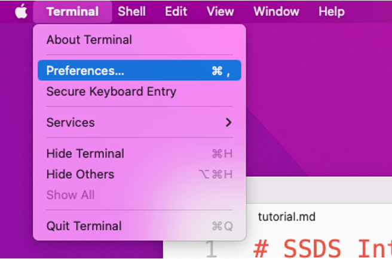
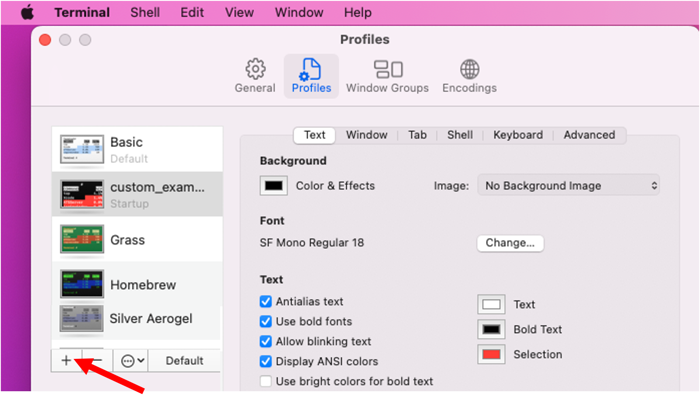
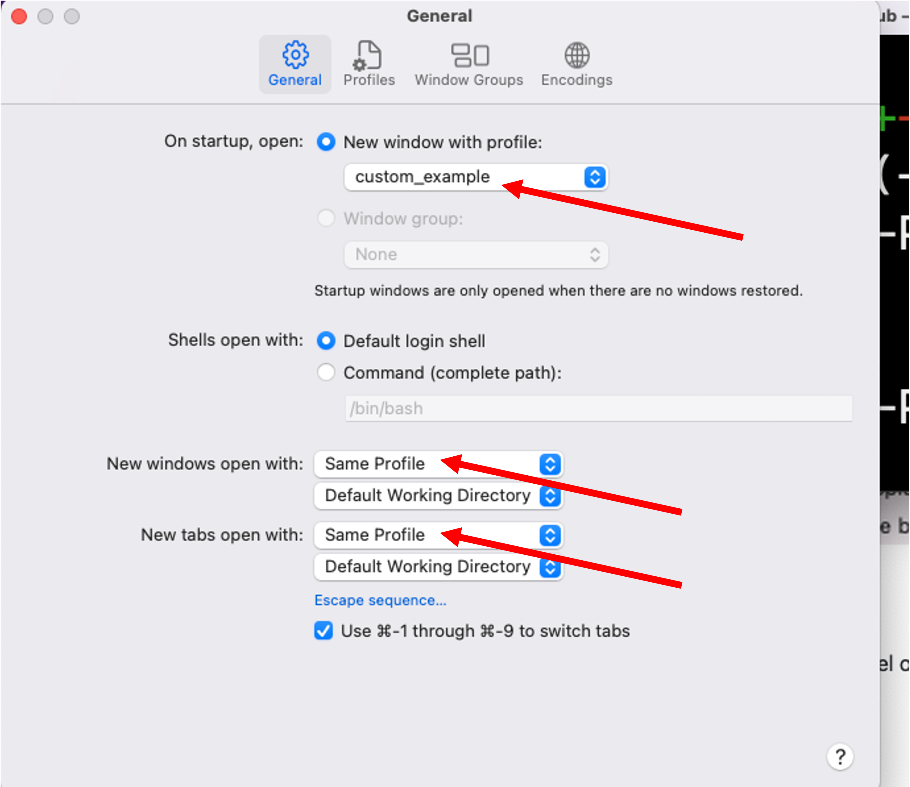
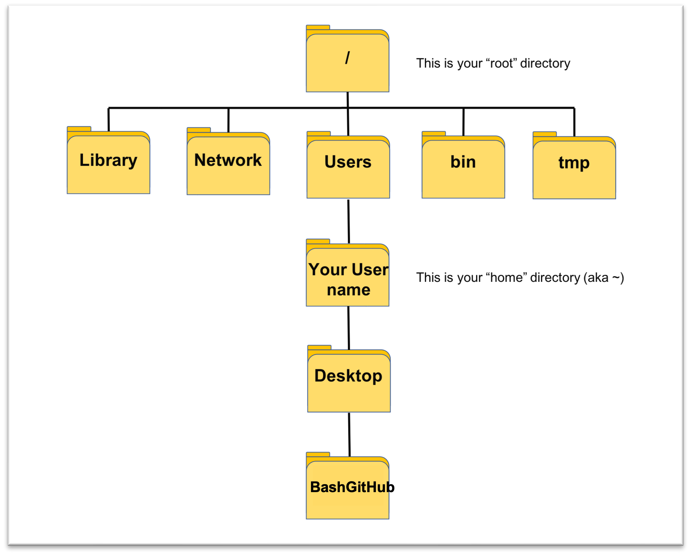

# SSDS Introduction to Bash and GitHub
A programming language can be thought of simply as a way to give instructions to a computer.

Bash (Bourne-Again SHell) is Unix shell/command language interpreter that is used to directly interact with your computer's operating system, and other things. It is also how we can program git, and interact with the social coding and version tracking website GitHub.

How do I access Bash?
* Mac users: open the Terminal app.
* Windows users: download GitBash here: https://git-scm.com/downloads  and open the GitBash app.

##  This workshop is divided into 6 sections and 3 challenges:
Section 1: Customize your terminal preferences  
Section 2: Navigate your computer's file system with basic Bash commands  
Section 3: Make folders and files  
Section 4: Create a GitHub account and make a new repository  
Section 5: Learn five main Git commands to clone, edit/add, commit, push, and pull  
Section 6: View your commits  
Challenge 1: Add a commit and look at the diff file  
Challenge 2: Add your neighbor to your repository as a collaborator  
Challenge 3: Running scripts

****

## Section 1
### Customize your terminal preferences
Click "Terminal" --> "Preferences"

Open your Terminal preferences to customize your terminal.

### "Profiles" tab
On the "Profiles" tab, you can create your own profile by clicking the "+" button in the bottom left. Set your window color, text size, etc, and load it up from the "General" tab.

My terminal is named "custom_example" and is designed for simpler visibility: a black background with white text and red cursor highlighting.  

### "General" tab
On the "General" tab, customize your window look and feel on startup.  

In the top drop down menu, select the name of your customized terminal. Make sure "Same Profile" is selected for "New windows open with:" and "New tabs open with:" further below.

### Change the prompt
The prompt is where we enter Bash code and is commly a `%` or `$` symbol by default. 

If you have a lot of stuff before your prompt, it can be difficult to see what you are typing. 

How is your prompt structured? Type:
`echo $PS1`

Change it by typing:
`PS1="\w\% "` - to show the full file path to your working directory (lower case w)  
`PS1="\W\% "` - to show just the current directory location (capital W)  

To have **no** prompt (just the cursor), type: `unset PS1`

> NOTE: These instructions are not guaranteed to work for all shells!

****

##  Section 2
### How are data stored?
A computer's file system is stored in a hierarchy. The common analogy is that it is like an inverted tree.
* The "root" `/` directory (synonymous with "folder") is the highest up you can go.
* Your "User" directory contains your computer's various user profiles.
* Your "user name" directory contains your Desktop, Downloads, etc. sub-directories. This is your "home" directory and is abbreviated with a tilde `~`

### Basic Bash commands to navigate your computer's file system

1. `whoami` - returns the user
2. `pwd` - print working directory (i.e., your current location)
3. `ls` - list files in working directory
4. `cd` - change directory

For example, print your working directory. You should be in your home folder by default:
`pwd`

Then, change your directory location to your Desktop
`cd Desktop`

Go up one level with
`cd ..`

Go to your home directory with
`cd ~`  (or simply `cd`)

You can also type in more than one folder in your path.
* An **absolute** file path goes back to the root directory
`cd /Users/yourusername/Desktop/BashGitHub`
`pwd`

* A **relative file path** starts at the current working directory
`cd`
`cd Desktop/BashGitHub`
`pwd`

### Tab completion
Use the "Tab" key to autocomplete your directory and file names. If Bash can see them, they will autocomplete. If not, you know something is wrong!

### Keyboard shortcuts

A few keyboard shortcuts will help you stay organized. On your keyboard, press:
5. `control + l` - clear console. This does not delete anything, it just moves the prompt back up to the top of the screen.  
6. use `up` and `down` arrow keys to cycle through your command history.  
7. `control + r` - recursive search. Use this to search for previous entries!  

If you get stuck!  
8. `control + c` - abort the current process and return to the prompt.  
9. `control + d` - [end transmission](https://en.wikipedia.org/wiki/End-of-Transmission_character), or shut down your terminal.  

More keyboard shortcuts: [How-to: Bash Keyboard Shortcuts](https://ss64.com/bash/syntax-keyboard.html)

****

## Section 3
### Making folders and files

Bash syntax is the command followed by the argument, i.e.  `command argument` and/or flags (options to customize the commands).

### Getting help
* `man open`
  * Press `spacebar` to advance the page or scroll with trackpad
  * Press the `q` key to quit and return to the Bash prompt
  * For example, how to use the `ls` command to return a slash `/` after each directory?

1. `mkdir` - make a new directory/folder

On your Desktop, make a new directory named  bash_example  
> NOTE: use an underscore `_` as a placeholder for a space

`cd Desktop`  
`mkdir bash_example`  
`ls -F`  

Then, `cd` into this new folder  
`cd bash_example`  
`pwd`  
`ls`  

3. `touch` - create a file named movies.txt  
`touch movies.txt`  

4. `open` - open a file  (`start` on windows)  
`open movies.txt`  

This will open in your systems default text editor.  
Type the name of your favorite movie, press return to add a new line, and save and close the file.  

5. `cat` - view contents of a file  
`cat` movies.txt  

****

## Section 4
### Create a GitHub account and make a new repository
How does this connect to GitHub? Let's first create a repository ("repo").  

1. Create a GitHub account here: https://github.com/signup?ref_cta=Sign+up&ref_loc=header+logged+out&ref_page=%2F&source=header-home  

Follow the prompts, enter your {at}Stanford{dot}edu email, select a username, and complete the signup process.  

2. Create a new Repository  
* Click "Repositories"  
* Click "New"  
* Give your "repo" (repository) a name. Let's all call it "challenge" (without the quotations)  
* Leave as public for now  
* Click "Add a README file"  
* Click "Create Repository"  

3. Edit the README file  
* Click the pencil icon to the right of README.md  
* Enter some descriptive text for your repo. View the [Markdown Cheatsheet](https://github.com/adam-p/markdown-here/wiki/Markdown-Cheatsheet) to learn how to stylize and format markdown. You can include formatted text, different sized headers, lists, images, hyperlinks, and more!

****

## Section 5
### Use Bash to connect to GitHub

There are five main git commands to add and edit files:  
1. `git clone URL` - is how you create an editable copy of a repo on your local machine/computer (where URL is the git URL of the repo to be cloned; see below)  
2. `git add` - is how you add instruct your local changes to be added to the GitHub repo  
    * Add all changes in a repo with `git add .`
    * Add specific files with `git add movies.txt`
3. `git commit` - will stage your local changes before pushing them to the GitHub repo
    * You will want to add a message like `git commit -m "small updates"`
4. `git push` - "push" (actually make) those changes from your local machine to the GitHub repo  
5. `git pull` - Update your local version with changes from the GitHub repo  
    > NOTE: this will not override any local changes!

**ALWAYS `git pull` before you do anything to be safe!** Check out this post to [prevent merge conflicts](https://dev.to/github/how-to-prevent-merge-conflicts-or-at-least-have-less-of-them-109p)

1. `git clone`  
* Navigate to the repo page  
* Click the green "Code" button  
* Click HTTPS  
* Click the "Copy" clipboard icon  
* type  `git clone ` and paste the URL after the space after the word "clone", e.g.,  
`git clone https://github.com/EastBayEv/BashGitHub.git`  

> NOTE: You will eventually want to do this with SSH keys. [Learn about SSH keys here](https://docs.github.com/en/authentication/connecting-to-github-with-ssh/about-ssh) and [how to add an SSH key to your GitHub account](https://docs.github.com/en/authentication/connecting-to-github-with-ssh/adding-a-new-ssh-key-to-your-github-account)  

2. `git add`  
* `cd` into the directory you just cloned  
* `mv` - cut/paste
* `cp` copy/paste

To cut/paste movies.txt from your **bash_example** directory into your **challenge** directory, use the folowing syntax:

`cp sourceLocation destinationLocation `

So, to copy the "movies.txt" file from the "bash_example" folder to the "challenge" folder, we have to enter a path for the "movies.txt" file.

It can be found one level up `..` and in a different folder `bash_example`. Then, we want to copy it to our current location, the "challenge" folder.
`cp ../bash_example/movies.txt challenge`

* Now type `git add .` to add all local changes to be added to the GitHub repository.
* Or, you can add indivdiual files like:
`git add movies.txt`

3. `git commit` and add a message with the -m flag!
`man git-commit` Note the use of the hypen to view help for the git commands!
`git commit -m "add movies.txt"`

4. `git push`
* Copy the changes from your local machine and push them up to GitHub

5. `git pull`
* If your computer is up to date with the GitHub version you will see the message "Already up to date."

****

## Section 6
### View your commits by clicking the little clock that says "# commits"

****

## Challenge 1: Add a commit and look at the diff file
1. Open movies.txt and delete the movie you previously entered. Enter three new movie titles here, each on a new line.
2. Type the name of a new movie, save the file, and repeat the above steps to `git add`, `git commit` and `git push` and add this edited file to your repository.
> NOTE: You DO NOT have to git clone a second time.
3. View the "diff" file. What changed?

****

## Challenge 2: Add your neighbor to your repository as a collaborator
1. Person A: creates a new file named music.txt and adds their favorite musical artist. `git add`, `git commit`, and `git push` this file to your repository.
2. Person B: `git pull` and then adds their favorite musical artist to a new line in music.txt. Then,  `git add`, `git commit`, and `git push` to the repository.
3. Person A: check that `git pull` works properly.
4. View the commit history to see who did what, when!

****

## Challenge 3: Running scripts
Run the below Bash commands and see what happens. If you get errors, how might you solve them?
1. How do you run the script `example_bash.sh` from the scripts/ folder?
This also works for Python and R scripts, and is essential to learn how to do when working with remote servers such as FarmShare and Sherlock.

****

## Bonus: Star this repository if you found this workshop helpful!
Follow liberally on GitHub, people are working on exciting code and projects every day :)

****

## Going further
* Take a screenshot with `screencapture screenshot1.png`  
* Open a directory `open ~/Desktop`  
* Open a website `open https://ssds.stanford.edu`  
* [Utilize the Bash buit-in text editor "vim"](https://www.linux.com/training-tutorials/vim-101-beginners-guide-vim/)  
* [Learn the hows and whys for Working with GitHub branches](https://docs.github.com/en/pull-requests/collaborating-with-pull-requests/proposing-changes-to-your-work-with-pull-requests/about-branches)  
* [Begin to understand permissions](https://linuxcommand.org/lc3_lts0090.php)  
